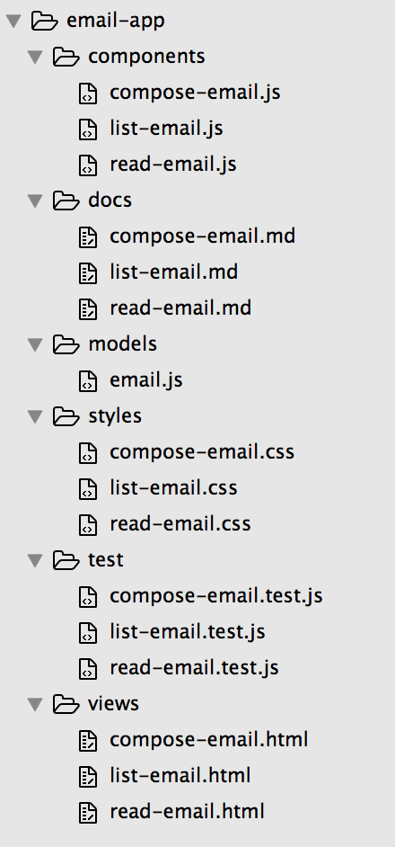
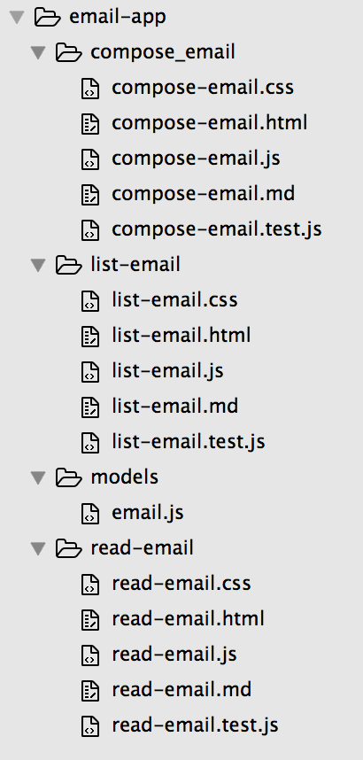

title: A brief history of Single Page Applications
output: index.html
theme: theme
controls: false
logo: theme/logo.png
style: style.css

-- centered

# A brief history of Single Page Applications

-- centered

## 2006: jQuery - New Wave JavaScript

### Used today by ~80% of the top million websites

<a href="http://web.archive.org/web/20090214090118/http://digg.com/programming/jQuery_-_New_Wave_Javascript"></a>

-- centered images

## 2000 - 2007: "Web 2.0"

JavaScript helper libraries:

[](http://mootools.net/)
[](http://prototypejs.org/)
[](https://script.aculo.us/)

Widget libraries:

[](http://yuilibrary.com/)
[](https://www.sencha.com/products/extjs/)
[](https://dojotoolkit.org/)

-- centered

## 2007 - Now: JavaScript application frameworks


-- centered images

# 

[](https://canjs.com/)
[](https://stealjs.com/)
[](https://funcunit.com/)
[](https://funcunit.com/)
[](https://github.com/bitovi/testee)

-- color blue hero

## Did we learn anything?

- The good and bad of owning the stack
- Long-term backwards compatibility is hard
- Evolving frameworks eventually turn into a collection of libraries
- Old ideas don't die
  - Functional Programming (LISP, 1960s) -> React, RxJS, ImmutableJS
  - SGML (ISO, 1986) -> HTML5
  - Flash MXML (Adobe, 2000) -> Angular, Vue.js
  - EJS (JavaScriptMVC, 2007) -> JSX

--

## A JavaScript project checklist

A checklist of things we found help guide the development of a JavaScript software project:

- The number of steps required for success is too complex for memory
- Learn from other's experience
- Force yourself to remember the "not so fun" stuff
- Guide awkward but important conversations

- [bitovi.github.io/checklist](http://bitovi.github.io/checklist/)

-- dark-grey hero centered

## A Bitovi Case Study

After filling out the checklist in hindsight for all of our previous projects, we calculated influence factors and recorded the correlation to project success for each category.

<br><br>

#### We defined success as on time and budget

[blog.bitovi.com/why-checklist](http://blog.bitovi.com/why-checklist/)

--

<h2 style="margin: 0 2em;"><em>"The major surprise in our data was that development factors are not nearly as meaningful in predicting success as design and management factors."</em></h2>

--

## Case Study Results

* Development __.20 ~ .28__
  * code reviews
  * tests, CI, documentation
* Design __.44 ~ .45__
  * user testing
  * design documentation
* Management __.45 ~ .48__
  * vision, goals and strategy
  * yearly trainings
  * release < 6 months

--

# Best practises

-- centered

## Modlets

<h1 style="height: 85%; vertical-align: center;">
  
  VS
  
</h1>

--

## State based routing

Map parts of the route to application state properties (and vice versa).

```javascript
const appState = {
  page: 'home',
  postId: null
};

route('/:page');
route('/:page/:postId', { page: 'posts' });

route.url({ page: 'posts', postId: 10 }); // /posts/10
route.url({ page: 'user', section: 'account' }); // /user?section=account
```

--

## Functional testing with FuncUnit

[](http://funcunit.com)

A functional testing library built on top of __jQuery__ and runs on __QUnit__, __Jasmine__ or __Mocha__:

- Write functional tests in your testing library of choice
- Use jQuery syntax to emulate user input

--

## __Testing a [TodoMVC](http://todomvc.com) app__

```javascript
test('TodoMVC app', function() {
  F('#new-todo').click().type('Do some nerdy stuff\r');
  F('#todo-list li').size(1, 'Got one Todo');
  F('#todo-list li:first label')
    .html('Do some nerdy stuff', 'Todo has correct text');
  F('#todo-count').html(/<strong>1<\/strong>(.*)item(.*)left/,
    'Todo count text is correct');
});
```

Automate it with any test QUnit, Jasmine or Mocha test runner ([example page](http://funcunit.com/site/examples/todo_qunit.html)).

--

## Two more things

--

## Services

-- presenter


## David Luecke

* [<i class="fa fa-github"></i> daffl](https://github.com/daffl)
* [<i class="fa fa-twitter"></i> @daffl](http://twitter.com/daffl)

[daffl.github.io/seattlejs](https://daffl.github.io/seattlejs)