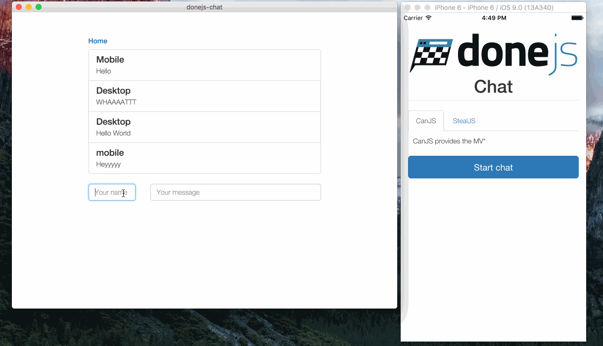

title: DoneJS - Your app. Done.
output: index.html
theme: theme
controls: false
logo: theme/logo.png
style: style.css

-- centered


-- centered

## Some history


-- centered

# Building JavaScript applications

-- color blue hero

## Maintainability

- _Dependency and package management_
- _Modern language features (ES6, JSX)_
- _Application architecture_
- _Development flow_
- Automated testing
- Continuous integration
- Avoid boilerplate
- Documentation

-- color light-grey hero

## Performance and usability

- _Server Side Rendering_
- CDN deploy
- Progressive Loading
- Minimal Data Requests
- Minimal DOM Updates
- _Real Time_
- _iOS, Android_
- _Desktop_

-- dark-grey hero

## So what is DoneJS?

- Open Source (MIT) JavaScript application stack
- Backend services agnostic
- Windows, Linux, OSX
- Comes with
  - [StealJS](http://stealjs.com) - ES6, CJS, and AMD module loader and builder
  - [CanJS](http://canjs.com) - Custom elements and Model-View-ViewModel utilities
  - [jQuery](http://jquery.com) - DOM helpers
  - [FuncUnit](http://funcunit.com) - Functional tests
  - [Testee](https://github.com/bitovi/testee) - QUnit, Mocha and Jasmine Test runner
  - [DocumentJS](http://documentjs.com) - Documentation
  - [can-ssr](http://github.com/canjs/ssr) - Server-Side Rendering Utilities for CanJS
  - [can-connect](https://github.com/canjs/can-connect) - Assemble real-time, high performance, restful data connections.

--

## Getting Started


> npm install donejs -g

> donejs add app donejs-chat

-- color blue hero

## Maintainability

- Dependency and package management
  - npm packages
  - ES6 imports
- Modern language features (ES6, JSX)
- Development flow
  - Hot-module swapping (live-reload)
- Application architecture
  - Components
  - Modlets
  - State-based routing

--

## Dependency and package management

> npm install bootstrap --save

```html
<can-import from="bootstrap/less/bootstrap.less!" />
<can-import from="donejs-chat/styles.less!" />
<can-import from="donejs-chat/app" export-as="viewModel" />

<div class="container">
  <div class="row">
    <div class="col-sm-8 col-sm-offset-2">
      <h1 class="page-header text-center">
        
        <br>Chat
      </h1>
    </div>
  </div>
</div>
```

--

## Components

> donejs add component home.component chat-home

```html
<can-component tag="chat-home">
  <style type="less">
    display: block;
    h1.page-header { margin-top: 0; }
  </style>
  <template>
    <h1 class="page-header text-center">
      
      <br>Chat
    </h1>

    <a href="{{routeUrl page='chat' }}" class="btn btn-primary btn-block btn-lg">
      Start chat
    </a>
  </template>
</can-component>
```

--

## Routing

> donejs add component messages chat-messages

```html
<!-- messages/messages.stache -->
<h5><a href="{{routeUrl page='home'}}">Home</a></h5>
<p>{{message}}</p>
```

Then in `app.js`:

```javascript
route('/:page', { page: 'home' });
```

--

## Switching between pages

```html
<!-- index.stache -->
<div class="container">
  <div class="row">
    <div class="col-sm-8 col-sm-offset-2">
      {{#eq page 'chat'}}
        <can-import from="donejs-chat/messages/">
          {{#if isPending}}Loading...{{else}}<chat-messages/>{{/if}}
        </can-import>
      {{else}}
        <can-import from="donejs-chat/home.component!">
          {{#if isPending}}Loading...{{else}}<chat-home/>{{/if}}
        </can-import>
      {{/eq}}
    </div>
  </div>
</div>
```

-- color light-grey hero

## Performance and usability

- Server Side Rendering
- Production builds
- Progressive Loading
- Real Time
  - Socket.io push updates
- iOS, Android
  - Cordova
- Desktop
  - NW.js

-- centered

## Server Side Rendering


--

## Real-time

> npm install steal-socket.io --save

```javascript
import io from 'steal-socket.io';

const socket = io('http://chat.donejs.com');

socket.on('messages created',
  message => messageConnection.createInstance(message));
socket.on('messages updated',
  message => messageConnection.updateInstance(message));
socket.on('messages removed',
  message => messageConnection.destroyInstance(message));
```

--

## Desktop and Mobile Builds



#### iOS/Android (Cordova)

> donejs add cordova

> donejs build cordova

#### Desktop (nw.js)

> donejs add nw

> donejs build nw

-- presenter


## David Luecke

* [<i class="fa fa-github"></i> daffl](https://github.com/daffl)
* [<i class="fa fa-twitter"></i> @daffl](http://twitter.com/daffl)
