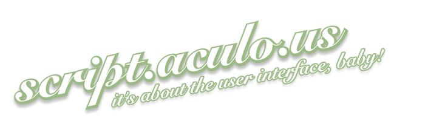

title: A brief history of Single Page Applications
output: index.html
theme: theme
controls: false
logo: theme/logo.png
style: style.css

-- centered

# A brief history of Single Page Applications

-- centered

## 2006: jQuery - New Wave JavaScript

### Used today by ~80% of the top million websites

<a href="http://web.archive.org/web/20090214090118/http://digg.com/programming/jQuery_-_New_Wave_Javascript"></a>

-- centered

## 2000 - 2007: "Web 2.0"

JavaScript helper libraries:

<a href="http://mootools.net/"></a> <a href="http://prototypejs.org/"></a> <a href="https://script.aculo.us/"></a>

Widget libraries:

<a href="http://yuilibrary.com/"></a> <a href="https://www.sencha.com/products/extjs/"></a> <a href="https://dojotoolkit.org/"></a>

-- centered

## 2007 - Now: JavaScript application frameworks


-- centered

# What did we learn?

--

## A JavaScript project checklist

## [http://blog.bitovi.com/why-checklist/](http://blog.bitovi.com/why-checklist/)

* Development

* Design

* Managment

### [To the checklist!](http://bitovi.github.io/checklist/)

--

## The major surprise in our data was that development factors are not nearly as meaningful in predicting success as design and management factors.

--

# A Bitovi Case Study

After filling out the checklist in hindsight for all of our previous projects, we calculated influence factors and recorded the correlation to project success for each category.

__We defined success as on time and budget__

--

* Development __.20 ~ .28__
  * code reviews
  * documentation
* Design __.44 ~ .45__
  * user testing
  * design documentation
* Management __.45 ~ .48__
  * vision, goals and strategy
  * release < 6 months

--

## Old ideas don't die

- Functional Programming (LISP, 1960s) -> React, RxJS, ImmutableJS
- SGML (ISO, 1986) -> HTML5
- Flash MXML (Adobe, 2000) -> Angular, Vue.js
- GWT (Google, 2006) -> TypeScript
- EJS (JavaScriptMVC, 2007) -> JSX

--

# Design patterns > Frameworks

--

## Modlets

--

## Models

--

# User Testing w/ [FuncUnit](http://funcunit.com)


--

# __FuncUnit__

Functional testing library built on top of __jQuery__ and runs on __QUnit__, __Jasmine__ or __Mocha__:

- Write functional tests in your testing library of choice
- Use jQuery syntax to emulate user input

--

# __Testing a [TodoMVC](http://todomvc.com) app__

```javascript
test('TodoMVC app', function() {
  F('#new-todo').click().type('Do some nerdy stuff\r');
  F('#todo-list li').size(1, 'Got one Todo');
  F('#todo-list li:first label')
    .html('Do some nerdy stuff', 'Todo has correct text');
  F('#todo-count').html(/<strong>1<\/strong>(.*)item(.*)left/,
    'Todo count text is correct');
});
```

-- presenter


## David Luecke

* [<i class="fa fa-github"></i> daffl](https://github.com/daffl)
* [<i class="fa fa-twitter"></i> @daffl](http://twitter.com/daffl)
